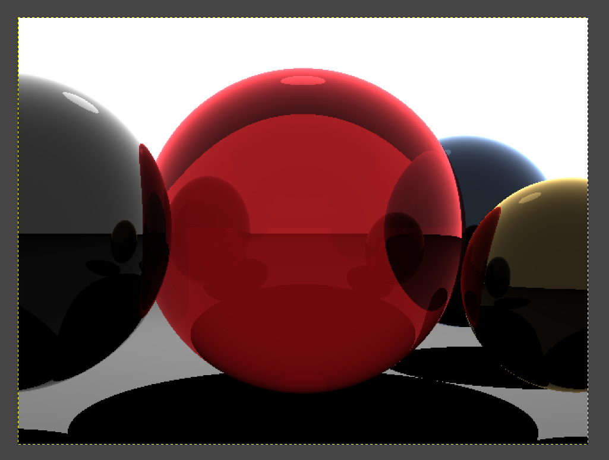

# Ray Tracer

This project is a ray tracing program written in C++ that renders simple 3D scenes with spheres and lighting effects. It demonstrates foundational concepts of ray tracing, including reflections and shadows. Unlike dynamic ray tracers, this implementation uses predefined scene parameters instead of generating them randomly.

## Features

- **Scene Rendering**: Renders predefined scenes with spheres and light sources.
- **Reflections**: Basic reflective surfaces for realistic lighting effects.
- **Shadows**: Cast shadows based on light source positions.
- **Anti-Aliasing (Optional)**: Smooth edges through jittered sampling (if enabled).

## How It Works

The program uses a basic ray tracing algorithm to simulate the interaction of light rays with objects in a static scene. The scene consists of:
1. A ground plane.
2. Multiple spheres with predefined positions, sizes, colors, and reflectivity.
3. A single light source with fixed intensity and position.

The output is saved as a `.ppm` image file.

## How to Run

### Prerequisites

- A C++ compiler (e.g., `g++`).
- A text editor or IDE to view/edit the code (e.g., Visual Studio Code, CLion).

### Steps

1. Clone this repository or download the source code:
    ```
    git clone https://github.com/prcsh14/Raytracer.git
    cd Raytracer
    ```

2. Compile the code using a C++ compiler:
    ```
    g++ -o raytracer main.cpp
    ```

3. Run the program:
    ```
    ./raytracer
    ```

4. The output image will be saved as `output.ppm` in the same directory.

5. Open the `.ppm` file using an image viewer that supports PPM format (e.g., GIMP) or convert it to another format using ImageMagick:
    ```
    convert output.ppm output.png
    ```

## Example Output

Here’s an example of what the rendered image might look like:



> **Note**: Ensure that the `images/example-output.png` file exists in your repository's `images/` directory.

## Related Projects and Resources

For inspiration or further learning about ray tracing, you can explore these repositories:

- [SlimTracin](https://github.com/HardCoreCodin/SlimTracin): A minimalist interactive/real-time ray tracer with optional GPU support.
- [Ray Tracing in One Weekend (C++)](https://github.com/Jomiri/raytracer): A basic ray tracer inspired by Peter Shirley's book, featuring modern C++ improvements like parallel rendering and PNG output.
- [Monte Carlo Ray Tracer](https://github.com/linusmossberg/monte-carlo-ray-tracer): A physically based renderer using advanced techniques like path tracing and photon mapping.
- [Rust One-Week-ish Ray Tracer](https://github.com/cbiffle/rtiow-rust): A Rust-based implementation of Peter Shirley's "Ray Tracing in One Weekend" series.

## Technologies Used

- **C++**: Core programming language used for implementing the ray tracer.
- **PPM Format**: Simple image format used for output.

## Future Improvements

- Add support for transparent materials.
- Implement texture mapping for more realistic surfaces.
- Optimize performance using multi-threading.
